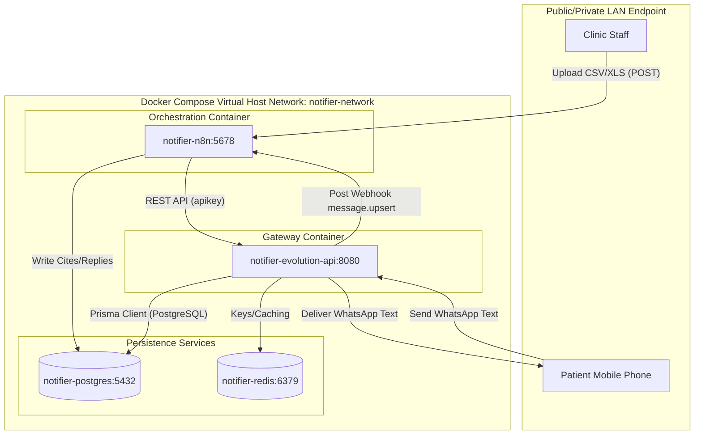
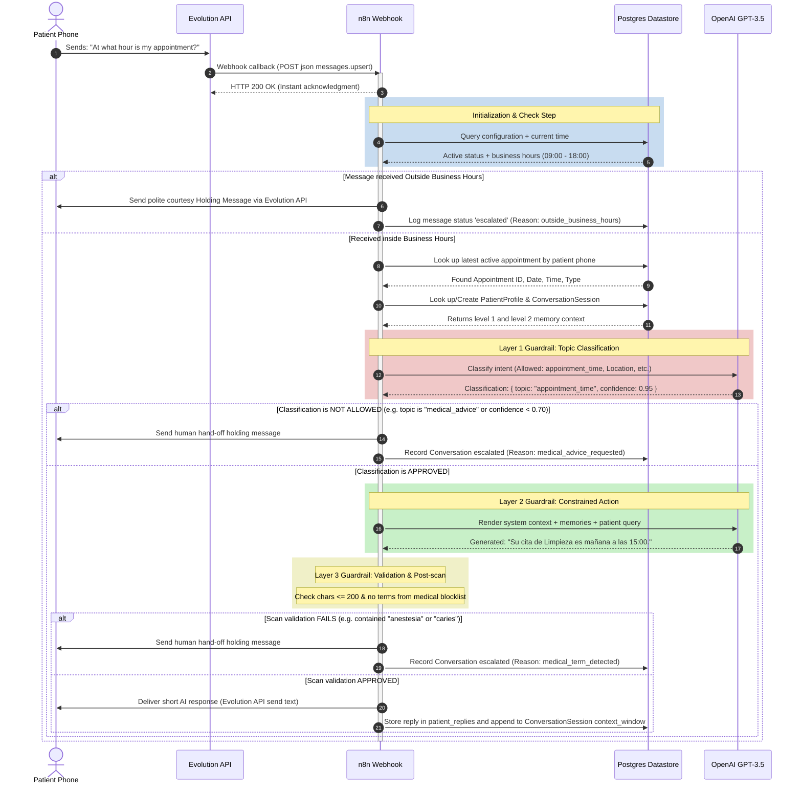

# System Architecture: WhatsApp Appointment Notifier

This document outlines the container federation, data directories, workflow orchestration pattern, and data flow topologies of the **WhatsApp Appointment Notifier** system.

---

## 🏗️ 1. Container Federation Diagram

The application runs in a isolated Docker Bridge network consisting of 4 dedicated daemon containers:



---

## ⚡ 2. Data Flow Topologies

### Flow A: Appointment Processing & Delivery (P1 - MVP)

This sequential flow runs when a staff member uploads an appointment spreadsheet:

1. **Trigger**: Multi-part CSV/XLSX file is POSTed to `http://<host>:5678/webhook/upload-appointments`.
2. **Immediate Reply**: n8n generates a UUID `batchId`, validates the file size under 10MB/1000 rows, and responds syncronously with `{ "batchId": "...", "status": "processing" }` to prevent clinic computer lockups.
3. **Parse & Normalization**:
   - Extraction of spreadsheet sheets using the custom node.
   - Script trims whitespace and parses dates/times.
   - Evaluates prefix condition: If phone lacks country prefix, injects configured `DEFAULT_COUNTRY_CODE`.
4. **Validation Check**: If columns pass checking, they are directed to the Database Write step. If failing, they are logged as a schema rejection reason in the DB and omitted from the send loop.
5. **Database Entry**: Inserts parsed rows into the `appointments` table with state `pending`.
6. **Delivery Loop (Throttle-Controlled)**:
   - For each valid appointment row, formatted reminders are assembled.
   - HTTP request executes to Evolution API `/message/sendText/{instance}` with payload delay of `1200ms`.
   - On delivery timeout or 5xx failures, n8n invokes Exponential Backoff retry strategy (re-queue with multiplier intervals: `5s`, `15s`, `45s`).
7. **Status Update**: Upon termination, database records are adjusted:
   - Success → Set `notification_status = 'sent'`, saving sent timestamp.
   - Failure → Set `notification_status = 'failed'`, saving explicit `error_reason`.
   - Logging results in `notification_records` table.

---

### Flow B: Conversational Reply & Guardrails (P2 - Bot Module)

This asynchronous flow executes when a patient replies to a sent reminder:



---

## 📂 3. Port Map & Database Directory Allocations

### TCP Port Declarations
* **5678** (n8n Webhook & Configuration Panel)
* **8080** (Evolution API Gateway API)
* **5432** (PostgreSQL Connection Port)
* **6379** (Redis Caching Port)

### Volume Mount Strategies
All datastores store states inside named docker volumes to guarantee state retention across reboots or deployments:

```yaml
volumes:
  notifier-postgres-data:   # Maps /var/lib/postgresql/data inside database container
  notifier-redis-data:      # Maps /data inside Redis container
  notifier-evolution-data:  # Stores Baileys credentials and connection state
  notifier-n8n-data:        # Holds workflow logs and node encryption credentials
```
