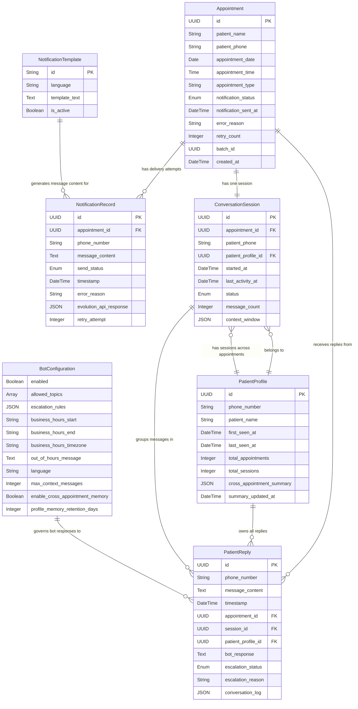

# Data Model: WhatsApp Appointment Notifier

**Date**: 2026-07-13
**Feature**: 001-whatsapp-appointment-notifier

## Entities

### Appointment

Represents a scheduled patient appointment extracted from an uploaded file.

| Field | Type | Required | Description |
|-------|------|----------|-------------|
| id | UUID | Yes | Internal identifier (generated by n8n) |
| patient_name | String | Yes | Patient's full name |
| patient_phone | String | Yes | Patient's phone number in international format (e.g., `+34612345678`) |
| appointment_date | Date | Yes | Appointment date (ISO 8601: `YYYY-MM-DD`) |
| appointment_time | Time | Yes | Appointment time (24h format: `HH:MM`) |
| appointment_type | String | Yes | Type/procedure description (e.g., "Consulta general", "Limpieza dental") |
| notification_status | Enum | Yes | One of: `pending`, `sent`, `failed` |
| notification_sent_at | DateTime | No | Timestamp when notification was sent (null if not sent) |
| error_reason | String | No | Failure reason if status is `failed` |
| retry_count | Integer | No | Number of delivery retry attempts (default: 0) |
| batch_id | UUID | Yes | Identifies the upload batch this appointment belongs to |
| created_at | DateTime | Yes | Record creation timestamp |

**Validation Rules**:
- `patient_phone` must match international phone format (`^\+[1-9]\d{6,14}$`)
- `appointment_date` must be a valid date in the future
- `appointment_time` must be a valid 24h time (`^([01]\d|2[0-3]):([0-5]\d)$`)
- `notification_status` transitions: `pending → sent` or `pending → failed` (via retry exhaustion)

**State Transitions**:
```
pending ──(send success)──→ sent
pending ──(send fail, retry < 3)──→ pending (retry)
pending ──(send fail, retry = 3)──→ failed
```

---

### Notification Record

Represents the outcome of a WhatsApp notification delivery attempt.

| Field | Type | Required | Description |
|-------|------|----------|-------------|
| id | UUID | Yes | Internal identifier |
| appointment_id | UUID | Yes | Reference to the Appointment |
| phone_number | String | Yes | Destination phone number |
| message_content | Text | Yes | The WhatsApp message text that was sent |
| send_status | Enum | Yes | One of: `success`, `failed`, `pending` |
| timestamp | DateTime | Yes | When the delivery attempt occurred |
| error_reason | String | No | Error description if failed |
| evolution_api_response | JSON | No | Raw response from Evolution API (for debugging) |
| retry_attempt | Integer | No | Which retry attempt this record represents (0 = first try) |

**Relationships**:
- Many Notification Records → One Appointment (each appointment may have multiple delivery attempts due to retries)

---

### Patient Reply

Represents an incoming WhatsApp message from a patient.

| Field | Type | Required | Description |
|-------|------|----------|-------------|
| id | UUID | Yes | Internal identifier |
| phone_number | String | Yes | Sender's phone number |
| message_content | Text | Yes | The patient's message text |
| timestamp | DateTime | Yes | When the message was received |
| appointment_id | UUID | No | Matched appointment (looked up by phone number); null if no match |
| bot_response | Text | No | The bot's response text (null if bot disabled or escalated) |
| escalation_status | Enum | Yes | One of: `none`, `escalated`, `resolved` |
| escalation_reason | String | No | Why escalation was triggered (e.g., "medical_advice_requested", "low_confidence", "reschedule_request") |
| conversation_log | JSON | Yes | Full conversation context for audit (classification results, guardrail checks, AI model output) |
| session_id | UUID | No | Reference to the ConversationSession for this appointment (null if no appointment matched) |
| patient_profile_id | UUID | Yes | Reference to the PatientProfile for this phone number |

**Relationships**:
- Many Patient Replies → One Appointment (a patient may send multiple replies)
- Many Patient Replies → One ConversationSession (replies within the same appointment conversation)
- Many Patient Replies → One PatientProfile (all replies from the same phone number across appointments)

---

### ConversationSession

Represents a conversation session scoped to a specific appointment. Groups all PatientReply messages exchanged while discussing a single appointment, enabling the bot to maintain short-term conversational context (memory per cita).

| Field | Type | Required | Description |
|-------|------|----------|-------------|
| id | UUID | Yes | Internal identifier |
| appointment_id | UUID | Yes | Reference to the Appointment this session is about |
| patient_phone | String | Yes | Patient's phone number (denormalized for quick lookup) |
| started_at | DateTime | Yes | When the first message in this session was received |
| last_activity_at | DateTime | Yes | Timestamp of the most recent message (updated on each new message) |
| status | Enum | Yes | One of: `active`, `closed`, `expired` |
| message_count | Integer | Yes | Total number of messages exchanged in this session |
| context_window | JSON | Yes | Sliding window of the last N messages (configurable, default 10) passed to the AI Agent as conversation memory. Format: `[{"role": "patient", "content": "...", "timestamp": "..."}, {"role": "bot", "content": "...", "timestamp": "..."}]` |
| patient_profile_id | UUID | Yes | Reference to the PatientProfile (cross-appointment memory) |

**Validation Rules**:
- One active session per `appointment_id` (a new session is created only when a new appointment notification is sent to the same patient)
- `context_window` is capped at `max_context_messages` (from BotConfiguration, default 10). Older messages are dropped from the window but retained in `PatientReply.conversation_log` for audit.
- `status` transitions: `active → closed` (appointment date passed + 24h), `active → expired` (no activity for 72h)

**State Transitions**:
```
active ──(appointment_date + 24h)──→ closed
active ──(no activity for 72h)──→ expired
active ──(patient requests reschedule, escalation)──→ closed
```

**Relationships**:
- One ConversationSession → One Appointment
- Many ConversationSessions → One PatientProfile (a recurring patient has one session per appointment)

---

### PatientProfile

Represents a patient identified by phone number, persisting across multiple appointments. Stores cross-appointment memory so the bot can recognize recurring patients and reference past interactions (memory per paciente).

| Field | Type | Required | Description |
|-------|------|----------|-------------|
| id | UUID | Yes | Internal identifier |
| phone_number | String | Yes | Patient's phone number (unique key, international format) |
| patient_name | String | No | Most recent known name (updated from the latest appointment file) |
| first_seen_at | DateTime | Yes | When this profile was first created (first interaction or first appointment) |
| last_seen_at | DateTime | Yes | Most recent interaction timestamp |
| total_appointments | Integer | Yes | Count of appointments associated with this phone number |
| total_sessions | Integer | Yes | Count of conversation sessions |
| cross_appointment_summary | JSON | Yes | Condensed summary of past interactions for the AI Agent prompt. Format: `{"last_appointment": {"date": "...", "type": "..."}, "known_preferences": ["prefers morning appointments"], "interaction_count": 5, "last_topics": ["appointment_time", "clinic_location"]}` |
| summary_updated_at | DateTime | Yes | When `cross_appointment_summary` was last regenerated |

**Validation Rules**:
- `phone_number` is unique — one profile per phone number
- `cross_appointment_summary` is regenerated (not on every message) when: a session closes, or every 24h if the profile has had activity, whichever comes first
- `cross_appointment_summary.known_preferences` is derived from patterns (e.g., patient always asks about parking → preference: "needs parking info"). Max 5 preference entries to keep the prompt small.
- `cross_appointment_summary.last_topics` stores up to 5 most recent topics from the patient's interactions.

**Relationships**:
- One PatientProfile → Many ConversationSessions (one per appointment)
- One PatientProfile → Many PatientReplies (all messages from this phone number)

**Memory Expiration**:
- `cross_appointment_summary` entries older than 90 days are pruned (configurable via `PROFILE_MEMORY_RETENTION_DAYS` in `.env`, default 90).
- If a patient has not interacted for 90+ days, the profile is retained but `cross_appointment_summary` is cleared (fresh start). The `patient_name` and `total_appointments` are preserved.

---

### Bot Configuration

Represents the configurable settings for the automated response bot.

| Field | Type | Required | Description |
|-------|------|----------|-------------|
| enabled | Boolean | Yes | Whether the bot is active (default: `false`) |
| allowed_topics | Array\<String\> | Yes | Topics the bot can respond to (e.g., `["appointment_time", "appointment_date", "appointment_type", "clinic_location"]`) |
| escalation_rules | JSON | Yes | Rules defining when to escalate (e.g., `{"medical_terms": true, "reschedule_request": true, "low_confidence_threshold": 0.7}`) |
| business_hours_start | String | Yes | Business hours start (24h format, e.g., `"09:00"`) |
| business_hours_end | String | Yes | Business hours end (24h format, e.g., `"18:00"`) |
| business_hours_timezone | String | Yes | Timezone for business hours (e.g., `"Europe/Madrid"`) |
| out_of_hours_message | Text | Yes | Message sent when patient replies outside business hours |
| language | String | Yes | Bot response language (default: `"es"`) |
| max_context_messages | Integer | Yes | Maximum number of messages retained in ConversationSession.context_window (default: 10) |
| enable_cross_appointment_memory | Boolean | Yes | Whether the bot receives PatientProfile cross-appointment summary in its prompt (default: `true`) |
| profile_memory_retention_days | Integer | Yes | Days to retain cross-appointment memory before pruning (default: 90) |

**Storage**: Stored as `config/bot-config.json` — loaded by n8n workflow at runtime. Changes take effect on next workflow execution without container restart.

---

### Notification Template

Represents a customizable message template for appointment reminders.

| Field | Type | Required | Description |
|-------|------|----------|-------------|
| id | String | Yes | Template identifier (e.g., `"appointment-reminder"`) |
| language | String | Yes | Language code (e.g., `"es"`, `"en"`) |
| template_text | Text | Yes | Message text with placeholders: `{{patient_name}}`, `{{appointment_date}}`, `{{appointment_time}}`, `{{appointment_type}}`, `{{clinic_name}}` |
| is_active | Boolean | Yes | Whether this template is currently in use |

**Example template**:
```
Hola {{patient_name}},

Le recordamos su cita en {{clinic_name}}:
📅 Fecha: {{appointment_date}}
🕐 Hora: {{appointment_time}}
🦷 Tipo: {{appointment_type}}

Si necesita reprogramar, por favor responda a este mensaje.
```

**Storage**: Stored as files in `config/notification-templates/` — loaded by n8n workflow at runtime.

---

### Deployment Package

Represents the packaged system artifact.

| Field | Type | Required | Description |
|-------|------|----------|-------------|
| version | String | Yes | Semantic version (e.g., `"1.0.0"`) |
| build_date | DateTime | Yes | When the package was built |
| components | Array\<String\> | Yes | List of included components (e.g., `["docker-compose.yml", "n8n-workflows", "evolution-api-config", "scripts", "config"]`) |
| artifact_filename | String | Yes | The tar.gz filename |
| checksum | String | Yes | SHA256 checksum of the artifact |

**Storage**: Generated by `scripts/package.sh` — metadata stored in `package-manifest.json` within the artifact.

---

## Entity Relationship Diagram



## Storage Notes

- **PostgreSQL**: Stores n8n workflow data (executions, credentials) and Evolution API data (WhatsApp instances, message logs). Appointment data is stored in a dedicated `appointments` table created via n8n's PostgreSQL node or an init script.
- **Redis**: Used exclusively by Evolution API for caching (session data, connection state). Not used for application-level data.
- **File-based configuration**: `bot-config.json`, `guardrails-rules.json`, and notification templates are stored as files in `config/` and mounted into the n8n container. This allows configuration changes without rebuilding images (FR-020).
- **n8n workflow execution context**: During a single notification batch, appointment data flows through n8n items (in-memory). For the bot workflow, appointment data is looked up from PostgreSQL by phone number on each incoming message.
- **Conversation sessions**: The `conversation_sessions` table stores per-appointment conversation context. The n8n bot workflow queries the active session by `appointment_id` (or `patient_phone` if appointment not yet matched), retrieves `context_window`, appends the new message, and updates `last_activity_at`.
- **Patient profiles**: The `patient_profiles` table stores cross-appointment memory. On first interaction from a phone number, a profile is created. On subsequent interactions, the profile is looked up and its `cross_appointment_summary` is included in the AI Agent prompt (if `enable_cross_appointment_memory` is enabled).
- **Memory lifecycle**: Session `context_window` is a sliding window (last N messages). Full history is preserved in `PatientReply.conversation_log`. Profile `cross_appointment_summary` is regenerated when a session closes or every 24h. Profile memory expires after `profile_memory_retention_days` (default 90 days).
